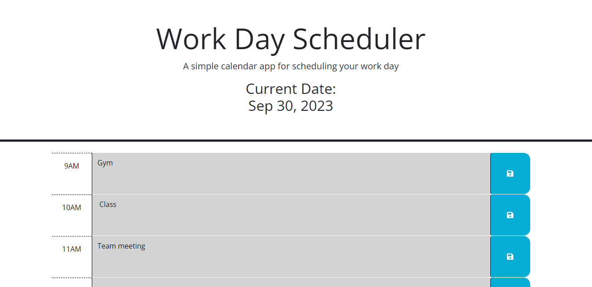

# RED-ROCKET

## Description
This Zachary McDowell's Module 5 Challenge; The Work Day Scheduler
 
This app will allow the user to fill in time blocks for their 9-5 schedule. The time blocks will change color to indicate if the hour is in the future, present, or has passed. The user's saved event will be stored.

Link to Deployed Application:
https://imshocker.github.io/red-rocket/

## Installation

N/A

## Usage

Track your workday schedule / check if you have any upcoming/missed events.

## Credits

N/A

## License

N/A

---